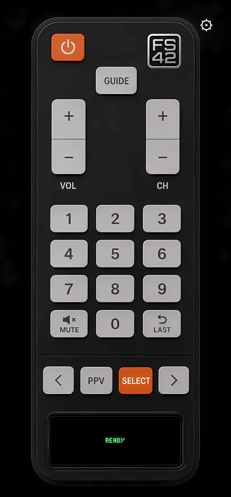

# FS42 Android Remote Maker

Native Android remote tooling and host-side helpers for FieldStation42.



## Layout

- `android/` contains the Android project to open, edit, and compile.
- `release/` contains the prebuilt APK for sideload testing.
- `fs42-guide-bridge/` contains the optional guide/status bridge.
- `install_guide_bridge.sh` installs the guide bridge onto the FieldStation42 host.

## Android App

To build the Android app from source, open or compile the project in `android/`.

```bash
cd android
./gradlew assembleDebug
```

The generated debug APK will be under:

```text
android/app/build/outputs/apk/debug/app-debug.apk
```

## Installable APK

A debug-signed APK for sideload testing is checked in at:

```text
release/fs42-remote-debug.apk
```

Copy or download that APK onto an Android device and sideload it. For a formal public release, build and sign a release APK separately.

## Creating Skins

See [Skin Authoring](docs/SKIN_AUTHORING.md) for how to create remote skins, choose image scaling, place touch zones, and use rectangle, circle, and polygon hit areas.

## Guide Bridge Host Install

The guide bridge is not installed on the Android device. It is installed on the same machine that already runs the original FieldStation42 repo, usually directly into that FieldStation42 install directory.

The bridge exists to feed the Android app's virtual VFD display. It converts FieldStation42 guide data into simple text for current/next show scrolling, and it also exposes host temperature, CPU load, and memory load for the remote's status display.

The installer copies the bridge files into the FieldStation42 folder and prefers the existing FieldStation42 Python venv at `env/` for dependencies and runtime.

```bash
./install_guide_bridge.sh
```

The Android app then talks to the bridge over LAN, defaulting to port `4243`.
